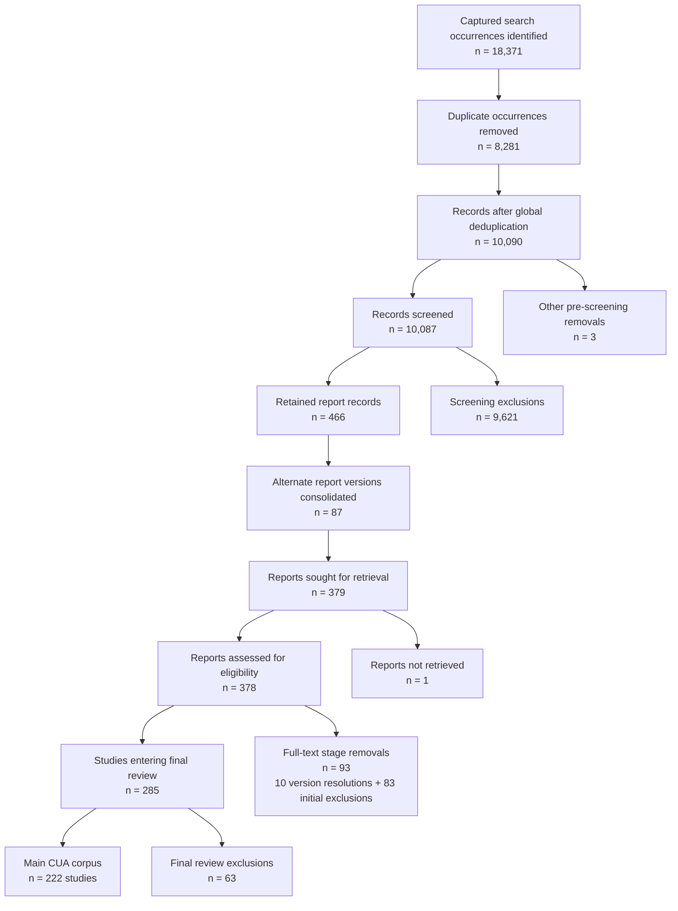

# PRISMA flow - final main CUA corpus

Detailed exclusion reasons are reported in `reports/fulltext_exclusion_reason_summary_83.csv` and `reports/author_adjudication_exclusion_reason_summary.csv`. Study-level exclusions are listed in the corresponding ledgers.
